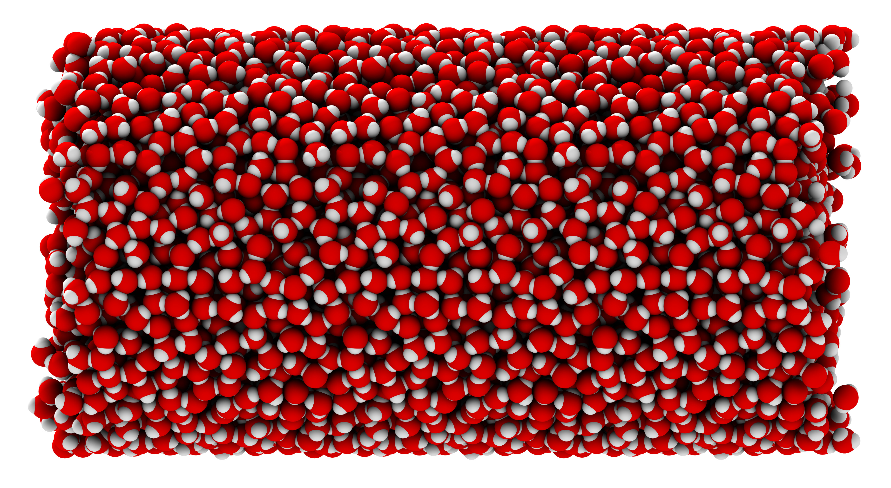

# MPhil in Scientific Computing - University of Cambridge
## Atomistic Materials Modelling Course - Practical 2

## Structure and Dynamics of Water

### Introduction
This assignment is to investigate some properties of liquid water using a computer.
You will learn how to simulate the time evolution of a “box of” water molecules using cp2k.
Just looking at the “movie” of how the water molecules move around is interesting, because water is a network liquid:
there are hydrogen bonds connecting every molecule to its neighbours, which are not as strong as covalent bonds, but strong enough so that at room temperature the molecules do not just slide past each other without hindrance.
The capacity of water to form hydrogen bonds contributes in a major way to its special role in the life of living organisms.

### Simulations
#### Before you start

Ensure you have the following applications installed and in your command line search:
1. `VMD`:\
VMD is a molecular visualization program for displaying, animating, and analyzing molecular systems using 3-D graphics and built-in scripting.\
Can either be installed via `conda`, or from source code (not advised for beginners).\
`conda install -c conda-forge vmd-python`
2. `CP2K`:\
CP2K is a quantum chemistry and solid state physics software package that can perform atomistic simulations of solid state, liquid, molecular, periodic, material, crystal, and biological systems.\
Can either be installed via `conda`, or from source code (not advised for beginners).\
`conda install -c conda-forge cp2k`
3. Make sure that you have clonded the repository with all required input files.\
`git clone https://github.com/cschran/mphil-amm-practical2.git`

If you don't have a working `conda` installation, it is very easy to setup via [`miniconda`](https://docs.conda.io/projects/miniconda/en/latest/).

Ensure that you have at least a rudimentary knowledge of the unix command line interface (also called the shell) to your computer, and can use grep, awk and other simple text manipulation tools to clean the output files to be processed.

Note that `VMD` stores its working and output files either in your home directory or in the directory you launched it from, depending on the installation. You might need to move files around.

### Run force field simulations
The directory `01-FF-Water` contains the input files for running an NVT simulation of 64 molecules of water in a periodic box. 
Familiarise yourself with the input and try to determine what functional forms are used to describe the inter- and intramolecular interactions.
`CP2K` input can be cryptic, but you can find more information in the [CP2K Manual](https://manual.cp2k.org/trunk/).\
Before you start the simulation, think about the limitations of this approach.

The simulation can be launched with the following command:\
`cp2k.psmp cp2k.inp > cp2k.out`

You can control the frequency of output and request printing more properties. Note also that you might want to experiment with longer simulations, or make changes to the thermostat, barostat, or timestep.

### Run simulations with a machine learning potential
The directory `02-MLP-Water` contains the input files for running an NVT simulation of the same box of water as before, but using a machine learning potential, trained to reproduce the energies and forces of the hybrid DFT functional rev-PBE0-D3.\
Again, take a look at the input and try to identify the differences to the force field simulation.

As before, the simulation can be launched with the following command:\
`cp2k.psmp cp2k.inp > cp2k.out`

How does the computing time compare to the FFMD simulation? What other differences do you notice?

### Analyse the properties of water
We will now move to computing properties using the output of the performed simulations.

1. Visualise the trajectory with `VMD`\
`vmd -e view-nice.tcl -args Nstart Nstop Nstep NAME-OF-TRAJECTORY.xyz` can be used to open the trajectory. Note that `view-nice.tcl` modifies the standard visualization and also sets the correct box size, that is not part of the xyz file format. It will also wrap all molecules back to the box. You will need to modify the parameters after `-args` to specify the start and stop frame, and how many frames should be skipped when reading the trajectory.\
What can you learn from this visualization and what differences do you observe comparing the two different simulation setups?

2. Check convergence and stability\
By plotting the time evolution of crucial properties, such as temperature, total energy, conserved quantity, make sure that your simulations are sane.\
Can you use these checks to determine when your simulations should be equilibrated?

3. Compute the Radial Distribution Function\
Use either `VMD` or other software (e.g. `ase`, `mdtraj`, or `MDAnalysis`) to obtain the RDF for the OH and OO pairs.\
Which of the two models do you think performs better?

4. Compute the diffusion constant of water\
Use the Einstein relation to compute the diffusion constant of water. You can again decide to use existing software packages for this analysis, but it might also be insightful to write your own code for this task.\
The Einstein relation in three dimensions is $\langle r^2\rangle = 6Dt$, where $r$ is the distance moved from the initial position, so $\langle r^2 \rangle$ is the mean of the squared distance (MSD), $D$ is the diffusion constant and $t$ is the elapsed time.
    1. Measure $\langle r^2\rangle$ as a function of $t$, and hence obtain $D$.
    2. Note that the MSD needs to be computed for unwrapped coordinates (as written to file by cp2k). Why?
    3. Compare the diffusivity you obtained with experimental values.

5. Modify the input files to perform NpT simulations (Optional)\
Change the input accordingly and use these new NpT simulations to obtain the equilibrium density of the two water models at 300K and 1bar.\
Which of the two models performs better?
